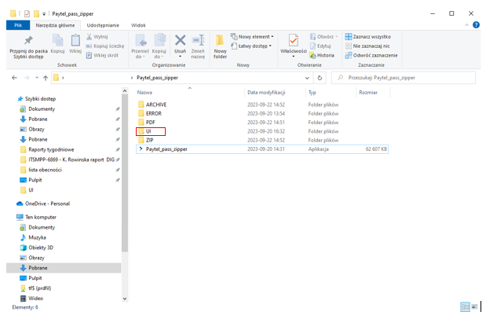

# Instrukcja obsługi Password Encrypter

Instrukcja obsługi aplikacji **Password Encrypter**, która umożliwia szyfrowanie haseł do plików PDF na podstawie numeru TVID. 

## Spis treści
- [Instalacja Microsoft ODBC](#instalacja-microsoft-odbc)
- [Instrukcja obsługi aplikacji](#instrukcja-obslugi-aplikacji)
- [Wymagania aplikacji](#wymagania-aplikacji)
- [Jak korzystać z automatu](#jak-korzystać-z-automatu)

## Instalacja Microsoft ODBC

Upewnij się, że masz zainstalowany sterownik **Microsoft ODBC Driver** do komunikacji z SQL Server’em. Możesz pobrać go z [tej strony](https://learn.microsoft.com/en-us/sql/connect/odbc/download-odbc-driver-for-sql-server?view=sql-server-ver16). Wybierz odpowiednią wersję (najprawdopodobniej (x64)) zależnie od Twojego systemu operacyjnego. Pamiętaj o zaakceptowaniu warunków licencyjnych. Do instalacji wystarczy zaznaczyć opcję klienta (domyślne ustawienia).

## Instrukcja obsługi aplikacji

1. **Pobierz i Rozpakuj Aplikację**
    - Pobierz aplikację z repozytorium.
    - Rozpakuj archiwum w wybranym miejscu na swoim komputerze.

2. **Uruchom Aplikację**
    - Otwórz folder **Paytel_pass_zipper**.
    - Uruchom plik **Paytel_pass_zipper.exe**.

3. **Połącz się z Bazą Danych**
    - Aplikacja zapyta o dane do połączenia z bazą danych. Wprowadź wymagane dane.

4. **Sprawdź Zawartość Foldera "PDF"**
    - Aplikacja sprawdzi, czy w folderze **PDF** znajdują się pliki z rozszerzeniem `.pdf` o nazwach identycznych z numerami TVID.
    - Jeżeli folder jest pusty, aplikacja poinformuje o tym fakcie.

5. **Szyfruj Pliki PDF**
    - Jeżeli pliki spełniają wymagania (rozszerzenie `.pdf` oraz zgodność z numerami TVID z bazą danych), aplikacja automatycznie je zaszyfruje.
    - W przeciwnym przypadku, aplikacja poinformuje o braku dopasowania w bazie danych.

## Wymagania aplikacji
- Aplikacja wymaga zainstalowanego **Microsoft ODBC Driver** do komunikacji z SQL Server’em.
- Nie usuwaj podfolderu **UI**, ponieważ zawiera pliki niezbędne do działania aplikacji.

## Jak korzystać z automatu
1. Upewnij się, że masz zainstalowany **Microsoft ODBC Driver** do komunikacji z SQL Server’em.
2. Pobierz aplikację z repozytorium.
3. Rozpakuj archiwum w wybranej lokalizacji na swoim komputerze.
4. Uruchom plik **Paytel_pass_zipper.exe**.
5. Podaj wymagane dane do połączenia z bazą danych.
6. Sprawdź, czy w folderze **PDF** znajdują się pliki zgodne z wymaganiami aplikacji.
7. Aplikacja automatycznie zaszyfruje pliki PDF spełniające kryteria.

**Gotowe!** Teraz możesz korzystać z **Password Encrypter** do szyfrowania haseł w plikach PDF na podstawie numeru TVID.

---

*Uwaga: Ta instrukcja obsługi jest podstawowym przewodnikiem dla użytkownika. Jeżeli napotkasz na problemy lub masz dodatkowe pytania, skontaktuj się z zespołem wsparcia technicznego.*